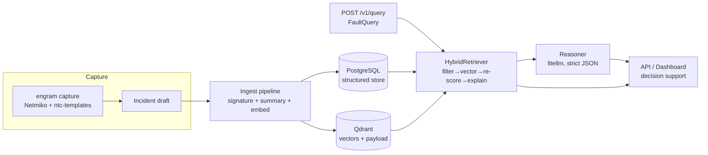

# 🧠 Engram

> **A network-specific incident memory layer.** Engram remembers how *this* network was actually fixed — the local, hard-won history that normally lives only in a senior engineer's head.

An *engram* is the physical trace a memory leaves in the brain. Engram is that trace for a network: every troubleshooting session (commands, outputs, root cause, fix, outcome) becomes a structured, vector-embedded incident. When a new fault appears, Engram retrieves the most similar past incidents *from that same network* and an LLM reasons comparatively — "this looks 85% like Incident #47, but today's BGP AS-path differs, so February's fix adapts to Y."

## The problem

Institutional network knowledge lives in senior engineers' heads and walks out the door when they leave. The same fault gets re-diagnosed from scratch, again and again. Generic docs and an LLM's textbook knowledge don't capture *what's true about your specific network* — which link is the ISP handoff, which fix worked here last February, which "obvious" fix already failed once.

## The solution

Engram stores each incident as **structured fields + a semantic embedding + a recorded outcome**, scoped to a tenant (`network_id`). On a new fault it runs **hybrid retrieval** (filter-then-rank) over that network's memory, then an LLM produces a **comparative analysis** grounded in the matched structured fields. It is **decision support, never autopilot**: it proposes, cites the incident it reasoned from, warns when a past fix FAILED or is stale, and always requires a human to approve.

## Why it's different from generic RAG

| Generic RAG | Engram |
|---|---|
| Embeds free text, ranks by cosine | **Filter-then-rank**: tenant + structured candidate filter *before* vector rank |
| No notion of "same kind of fault" | **Symptom signatures** (`BGP_NEIGHBOR_DOWN`, `MTU_MISMATCH`) normalize faults |
| Stale docs ranked like fresh ones | **Topology-aware staleness** (age + `topology_hash` mismatch), surfaced not hidden |
| Only stores "the answer" | **Outcome tracking** — including FAILED fixes, so you don't repeat them |
| One shared corpus | **Multi-tenant isolation** in both Postgres and Qdrant |

Two incidents can read almost identically in English yet be different faults (different device, different AS, different root cause). Embeddings alone will conflate them; the structured score separates them.

## Architecture



- **Capture** turns a real troubleshooting session into a structured `Incident` (raw output always retained; parsed where a template exists).
- **Ingest** derives the signature, builds the embedding text, embeds it *locally*, and dual-writes to Postgres (truth) and Qdrant (vectors + structured payload).
- **Hybrid retrieval** applies the tenant hard-filter, a relaxable structured candidate filter, vector ranking, a transparent re-score, staleness, and a plain-English match explanation.
- **Reasoning** compares the new fault to the retrieved incidents and returns a strict-JSON `ReasoningResult` (provider chosen via env).
- **API / Dashboard** expose all of it; the dashboard talks only to the API.

## Tech stack

- **API**: FastAPI + Uvicorn · **Models/config**: Pydantic v2 + pydantic-settings · **CLI**: Typer
- **Structured store**: PostgreSQL 16 + SQLAlchemy 2.0 + Alembic · **Vector store**: Qdrant
- **Embeddings (local, open-source)**: sentence-transformers (`BAAI/bge-small-en-v1.5`, 384-dim)
- **Reasoning LLM (swappable, the only paid dep)**: litellm (Anthropic / OpenAI / Gemini)
- **Capture**: Netmiko + ntc-templates (+ optional Genie) · **Dashboard**: Streamlit
- **Demo network**: Containerlab + FRRouting · **Infra**: docker-compose · **Quality**: pytest, ruff, mypy, pre-commit

## Incident schema (key fields)

| Group | Fields |
|---|---|
| Identity | `id`, `network_id` (tenant), `occurred_at`, `handled_by`, `title`, `tags` |
| `symptom` | `description`, `affected_layer` (L1–L7), `protocols[]`, `scope`, **`signature`**, `severity` |
| `context` | `devices[]`, `topology_snapshot`, **`topology_hash`**, `config_fragments` |
| `investigation[]` | `device`, `command`, `raw_output`, `parsed_output` |
| `resolution` | `root_cause`, `fix_description`, `config_diff`, `commands_applied[]` |
| `outcome` | **`status`** (RESOLVED/PARTIAL/FAILED/UNKNOWN), `verification_method`, `verified`, `mttr_seconds` |

## Retrieval logic (filter-then-rank)

1. **Tenant hard filter** — Qdrant `must` `network_id == query.network_id` (no cross-tenant leakage, ever).
2. **Structured candidate filter** — prefer incidents sharing ≥1 protocol / the layer / the signature; **relax to tenant-only** if it yields `< k*2` candidates.
3. **Vector rank** — embed the query locally, search within candidates, take top N.
4. **Re-score** — `final = w_v·vector + w_s·structured` (structured = protocol overlap, layer, signature, device overlap, severity proximity, recency).
5. **Staleness + explain** — surface age/topology staleness and a plain-English match explanation; flag FAILED prior fixes.

## Multi-tenancy & scale

Every incident carries a `network_id`. Reads, writes, and searches are scoped to one tenant in **both** stores (Postgres `WHERE network_id=` + Qdrant `must` filter). Auth is **API-key per tenant**: the `tenants` table maps `X-API-Key → network_id`, and handlers take the tenant from the key, never the request body. Add a network = add a key; the data plane scales horizontally behind that boundary.

## AIOps integration — `POST /v1/query`

The single endpoint an AIOps system calls. Request (`FaultQuery`):

```json
{
  "description": "Site B (R3) not learning Site A routes; BGP session looks up; AS-path filtering suspected",
  "protocols": ["BGP"], "affected_layer": "L3", "devices": ["R3","R2"],
  "current_topology_hash": "topo-v1"
}
```

Response (abridged):

```json
{
  "retrieved": [
    {"incident": { "...": "#47 BGP neighbor down" },
     "vector_score": 0.71, "structured_score": 0.83, "final_score": 0.76,
     "match_explanation": "matched on protocol=BGP, layer match, signature match, device overlap=R3",
     "staleness": {"age_days": 134, "topology_changed": false, "stale": false},
     "outcome_flag": null}
  ],
  "reasoning": {
    "comparisons": [{"incident_id": "…", "similarity_pct": 85,
                     "rationale": "same signature + device R3", "key_differences": ["different AS-path"]}],
    "recommended_hypothesis": "inbound AS-path filter on R3 dropping Site-A routes",
    "recommended_fix": "remove/relax the route-map; adapted from #47 (which was a remote-as typo)",
    "adapted_from": ["…"], "warnings": [], "confidence": "medium",
    "requires_human_approval": true
  }
}
```

`X-API-Key` header required. Full OpenAPI at `/docs`.

## Quickstart

```bash
# 1) install
pip install -e ".[dev,dashboard]"

# 2) configure secrets (see "What you must fill in" below)
cp .env.example .env.local      # then edit .env.local

# 3) infrastructure
docker compose up -d            # Postgres + Qdrant

# 4) schema + bootstrap tenant + Qdrant collection
make migrate                    # alembic upgrade head + engram bootstrap

# 5) run
make api                        # FastAPI at http://localhost:8000  (/docs)
make dashboard                  # Streamlit at http://localhost:8501

# 6) seed REAL incidents (needs Docker + Containerlab)
#    follow scripts/seed_runbook.md

# 7) the demo query
curl -s -X POST localhost:8000/v1/query \
  -H "X-API-Key: $ENGRAM_BOOTSTRAP_API_KEY" -H 'Content-Type: application/json' \
  -d '{"description":"R3 not learning Site A routes; BGP up; as-path suspected","protocols":["BGP"],"affected_layer":"L3","devices":["R3","R2"],"current_topology_hash":"topo-v1"}'
```

## Demo walkthrough

Run `scripts/seed_runbook.md` to:
1. Deploy the FRR topology and capture **Incident #47** (BGP neighbor down — remote-as typo, RESOLVED).
2. Capture an MTU-mismatch incident, and a blackhole incident recorded **FAILED then RESOLVED** (proving failure memory).
3. Inject `bgp_aspath_variant.sh` — *same symptom as #47, different root cause (AS-path filter)*.
4. Call `/v1/query` (or the dashboard's **New Fault** page) and watch Engram surface **"≈85% like Incident #47"**, name the **AS-path difference**, adapt the fix, and warn about any FAILED prior fix.

## Roadmap

Feedback-weighted retrieval (boost fixes that worked) · auto-topology snapshots via streaming telemetry · more vendor parsers · an eval harness for retrieval + reasoning quality · richer config-diff capture.

## What's real vs. needs your machine

- **Real & local**: embeddings (sentence-transformers), Postgres + Qdrant writes, vector search, filter-then-rank scoring, signatures, the API, the dashboard, and the test suite (real in-memory Qdrant + SQLite, real captured-output fixtures).
- **The only paid dependency**: the reasoning LLM (Anthropic/OpenAI/Gemini via litellm). With a placeholder key, retrieval still works and reasoning returns a clear "configure your key" message — it is never faked.
- **Runs on your machine**: Docker (Postgres/Qdrant) and Containerlab + FRR (the demo network). These aren't available in every build sandbox; the topology, fault scripts, and runbook are complete and verified by syntax + the capture/ingest path against committed real-output fixtures.

## License

Apache-2.0. Open-source everything except your choice of reasoning LLM.
